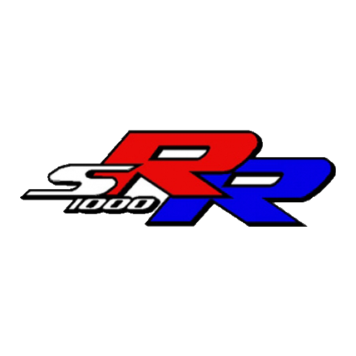

<h1><strong>BMW S1000RR</strong> - Parallax Website</h1>

<h2>
  <a href="">Live Project Link</a>
</h2>

    

 

Welcome to the BMW S1000RR Parallax Website! This website is designed to showcase the beauty and performance of the BMW S1000RR, a true masterpiece in the world of sport bikes.

---

Race to win with the BMW S1000RR. Designed for the track, this sport bike delivers uncompromising performance. 
 
I hope you enjoy exploring the BMW S1000RR through this parallax website as much as I enjoyed creating it. Feel free to share your thoughts and feedback!

 
 
 
 
 

---

© 2023 BMW S1000RR parallax website | Purna Shrestha | . All rights reserved.

