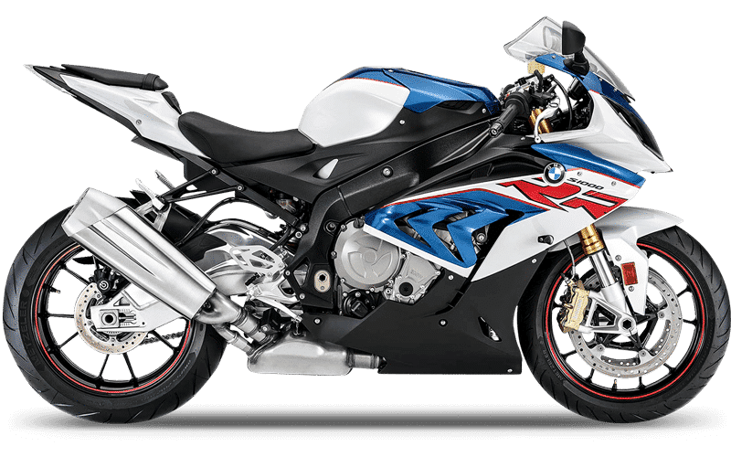

<h1><strong>BMW S1000RR</strong> - Parallax Website</h1>

<h2>
  <a href="">Live Project Link</a>
</h2>

    

 

Welcome to the BMW S1000RR Parallax Website! This website is designed to showcase the beauty and performance of the BMW S1000RR, a true masterpiece in the world of sport bikes.

---

## Specifications

The BMW S1000RR comes with an impressive set of specifications:

- **Engine:** 999cc In-line 4-cylinder
- **Horsepower:** 205 hp @ 13,500 rpm
- **Torque:** 83 lb-ft @ 10,500 rpm
- **Frame:** Twin-spar aluminum frame
- **Suspension:** Adjustable front and rear suspension

## In Action

    

Race to win with the BMW S1000RR. Designed for the track, this sportbike delivers uncompromising performance.

---

© 2023 BMW S1000RR Parallax Website. All rights reserved.
